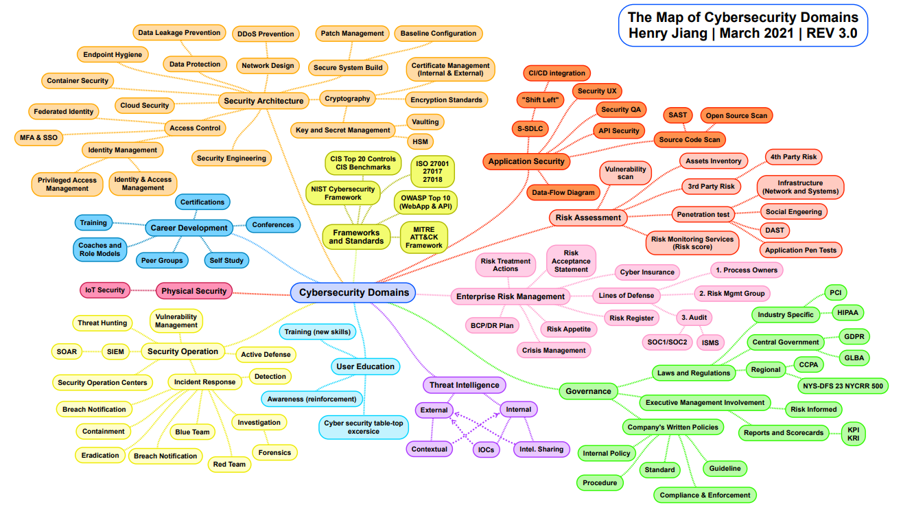

# **Article** 

## **Pourquoi se spécialiser en cybersécurité ?**

### 1 - Le domaine de la cybersécurité

 

Attaque par ransomware, fuite de données sensibles, RGPD, CloudAct, Fake news, Cybercriminalité , cyber hybride , hacking hameçonnage ,... ces termes faisant partie de l’actualité quotidienne  vous disent-ils quelque chose ? 

Si non , alors bienvenue dans le monde de la cybersécurité. 

Selon wikipédia, la cybersécurité  désigne  le rôle de l'ensemble des lois, politiques, outils, dispositifs, concepts et mécanismes de sécurité, méthodes de gestion des risques, actions, formations, bonnes pratiques et technologies qui peuvent être utilisés pour protéger les personnes et les actifs informatiques matériels et immatériels (connectés directement ou indirectement à un réseau) des États et des organisations.  Elle est basée sur les principes de Confidentialité , d’Intégrité et de Disponibilité. Nous avons un article abordant ces trois critères que nous vous invitons à lire.

Une personne travaillant dans la cybersécurité aura  pour objectif de protéger les infrastructures informatiques  contre des acteurs malveillants et ce, quelque soit la nature et le type d’entreprise, **un héros du monde numérique** :).

### 2 - Un domaine vital pour le secteur du numérique 

Mettre en œuvre des mesures de cybersécurité efficaces s’avère être particulièrement difficile de nos jours, car il existe plus d’appareils que de personnes dans le monde et les agresseurs deviennent de plus en plus innovants.

Les personnes en charge de la cybersécurité seront chargées de résoudre  des problématiques de sécurisation des objets connectés, de  simulation d’une cyber attaque orchestrée par des acteurs étatiques, de la mise en place d’un plan de continuité ou de reprise d’activité après un attaque par ransomware  ou de la protection des systèmes critiques d’un pays.

Entrer dans le secteur de la cybersécurité, c’est entrer dans le monde de la protection des infrastructures vitale d’une nation ( banque, energie, transport,...) , d’une entreprise ( protection de la propriété intellectuelle, données des clients,...) tout en assurant  la sécurité des particuliers ( protection de l’identité numérique sur internet,  mesures de protections des ordinateurs, téléphone mobile,...).

### 3 - Un secteur lucratif et une pénurie de talents

Le marché mondial de la cybersécurité était évalué à 132,94 milliards USD en 2021 et devrait croître à un taux de croissance annuel de 14,1 % de 2022 à 2027. Ce marché en pleine croissance a fortement augmenté ces dernières années à  cause de la pandémie qui a occasionné l’adoption du télétravail ou du travail hybride mais aussi des cyberattaques de plus en plus sophistiquées  par des acteurs malveillants de plus en plus bien organisés.

Mais ce  domaine en pleine croissance est confronté à  une forte pénurie de talents sur tous les continents à tel point que Christophe Auberger, directeur technique, Fortinet affirmait que : 

  
> « Le recrutement des meilleurs talents en sécurité est devenu très complexe. 45 % des entreprises indiquent qu’elles peinent à pourvoir les postes ouverts dans cette discipline. La problématique devrait d’ailleurs s’accentuer : aujourd’hui, ce sont plus d’un million de postes de professionnels de la sécurité, à l’échelle mondiale, qui sont vacants et ce chiffre devrait bondir à 3,5 millions d’ici 2021. » .

Il est donc important d'améliorer et d’adapter la formation dans les écoles, centre de formation spécialisés dans le but de combler ce gap. 
Si vous voulez entrer dans la cybersécurité, sachez que vous serez chouchoutés par toutes sortes d'entreprises. 

### 4 - Une diversité de métiers  à impact réel

La cybersécurité regorge d’une panoplie de sous-domaines. Nous avons des métiers opérationnels, comme les spécialistes de la gestion d’identité qui se chargeront de mettre en place des stratégies de gestion de systèmes d’authentification et de la gestion des privilèges des utilisateurs dans une organisation et des métiers décisionnels comme ceux en charge de la conformité.

 

 Vous trouverez forcément un métier qui vous plaira :) 

 Ces métiers font des spécialistes de la cybersécurité des acteurs indispensables pour la survie d’une entreprise  ou d’un État et même de l’infrastructure internet.

 

 Pour aller plus loin et avoir une meilleure connaissance (formations, compétences requises, activités et tâches quotidiennes)  desdits métiers, vous pouvez consulter  l’édition 2020 du
 [panorama des métiers de la cybersécurité](https://www.ssi.gouv.fr/uploads/2021/10/anssi-panorama_metiers_cybersecurite-2020.pdf) de l’Agence de sécurité des systèmes d'information (ANSSI).

Nous vous attendons, à bientôt :) .

