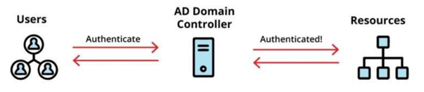
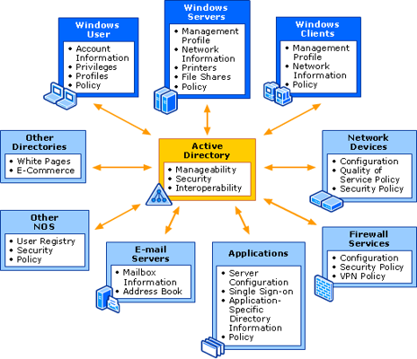
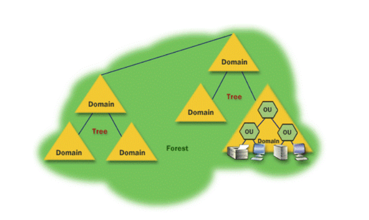

<h1><strong>Active Directory: Les bases à connaître)</strong></h1>

 
 

Cette série d'article portera sur l’Active Directory et les principaux vecteurs de risques auxquels il est soumis. En effet, bon nombre d’entreprise de nos jours utilisent l’AD pour bien de fonctions. Dans l’optique de favoriser la compréhension de ce point clé par tous, nous allons entamer cette série avec un article portant sur le vocabulaire à connaître sur l’AD.

## Mais d’abord qu’est ce que l’Active Directory ?

L’active Directory est un service d'annuaire LDAP créé par Microsoft en 1996 pour les systèmes d’exploitation Windows (Windows Server 2000, 2003, 2008, 2012 et 2016). Son principal objectif est de centraliser l’identification et l’authentification d’un réseau de postes Windows à travers le stockage des renseignements relatifs aux ressources du réseau dans une base de données. Autrement dit, il enregistre des informations par rapport aux membres des domaines en incluant les équipements et utilisateurs du réseau, il vérifie les identifiants (login et mot de passe) entrés par les différents membres et définit les droits d’accès vis -à -vis des ressources qui y sont connectés.

Lorsque vous intégrez une nouvelle entreprise, dépendant de leur maturité, une liste des ressources auxquelles vous avez accès doit être communiquée au support IT qui préparera par conséquent votre compte sur l’AD et vous remettra votre ordinateur si votre fonction le permet. Dès votre première connexion sur l’ordinateur et plus précisément sur le domaine de l’entreprise, il vous sera demandé un login et un mot de passe qui vont être soumis à l’AD et vérifiés par la suite. Si les login et mot de passe sont valides, vous aurez donc accès maintenant aux ressources de l’ordinateur en local ainsi que celles qui vous ont été attribuées via l’AD.

 

 
Source: University.tenable.com (TCSA)

  

Pour les personnes qui ne l’ont toujours pas compris, il faut dire que Active Directory est un produit purement Windows et ne fonctionne pas pour les autres OS connus du style Linux ou MacOS qui eux peuvent toujours reposer sur le protocole LDAP ou les serveurs Radius pour la réalisation des actions embarquées dans l’AD.

Avec l’essor du cloud durant ces dernières années, deux types de Active Directory ont vu le jour. On note l’Active Directory qui est dédié aux solutions de Microsoft on-premises (c'est à dire hébergées totalement sur des serveurs locaux de l’entreprise) et Azure Active Directory qui lui est dédié aux solutions Microsoft Cloud. Il est de même possible de fonctionner en hybride si une entreprise possède à la fois des solutions Windows on premises et sur le cloud.
Active Directory permet aussi aux administrateurs systèmes de pouvoir mettre en œuvre une stratégie de groupe qui leur permettra de gérer efficacement l’environnement des utilisateurs et la configuration des machines grâce à l’application de politiques. L’AD est donc un outil très intéressant dans le management des utilisateurs, des ordinateurs et de tout type d’objet vis à vis de l’ensemble des changements possibles qui pourraient avoir lieu au niveau du système d’information tel que le déploiement des logiciels, des mises à jour ou des configurations à l’échelle des parcs informatiques.

 

Source: Active Directory Collection: Active Directory | Microsoft Docs

Ce schéma nous présente les objets avec lesquels échangent l’Active Directory et leurs attributs afin de réaliser plusieurs actions, rendant l’AD indispensable pour avoir une visibilité totale sur le système informatique. Ce schéma est à la fois unique, modifiable et extensible car il peut être adapté pour implémenter de nouveaux types d’objets ou de propriétés d’objet.

L’AD permet de fournir différents services globaux à travers l’ensemble des objets avec lesquels il communique tel que:

- 
La mise à disposition d’un mécanisme de requête et d’index qui permet de rechercher et de publier si besoin des objets et leurs attributs
- 
L’utilisation d’un catalogue global contenant les informations sur chaque objet du répertoire. Les utilisateurs et les administrateurs sont capables d’utiliser des outils sur leurs différents postes afin d’effectuer des recherches dans les services de domaine Active Directory.
- 
La mise à disposition d’un service de réplication distribuant les informations entre les contrôleurs de domaine telles que les mises à jour d’annuaire.

Oula!! Cet article commence à devenir compliqué. Non ! Ne vous inquiétez pas. Les articles qui viendront vous permettront de mieux saisir des points évoqués aujourd’hui donc n’hésitez pas à visiter notre page fréquemment :-)

Cependant, depuis le début de cet article, nous avons abordé le terme “objet”. Mais qu’est ce que c’est qu’un objet Active Directory ? 

 Au niveau de l'Active Directory, les objets sont de trois types :

- 
 Les ressources qui englobent les postes de travail, imprimante, scanner, dossiers partagés, etc.

- 
 Les utilisateurs qui intègrent les comptes individuels et groupes, c'est-à-dire des listes d'utilisateurs avec leurs droits et leurs services)
- 
 Les services tels que l’utilisation des courriers électroniques ou les demandes DNS au sein du système . 
  
**Nous reviendrons sur quelques exemples de services AD dans notre prochain article.**

 
Les objets sont souvent difficiles à cerner pour les débutants au niveau de l’AD car ils peuvent englober d’autres objets. Chaque objet possède de même une identification unique et des attributs. Lorsque ces objets sont bien paramétrés, ils renferment le détail des ressources spécifiques que possède le système informatique d’une entreprise et se doivent donc d’être protégés pour éviter qu’un possible attaquant ait une visibilité totale du SI en place.

## Abordons maintenant la structure de l’Active Directory

 Dans l’AD, il faut préciser qu’il y a deux types de structure: la structure logique et la structure physique. Débutons avec la structure logique.

 
  
Active Directory est composée d'objets hiérarchisés contenus dans des Unités Organisationnelles (Organizational Unit OU en anglais). De manière générale, l’AD est hiérarchisé et présente une structure arborescente composée de trois degrés : 

- 
Le domaine représente la plus petite unité au niveau de la structure générale AD. Il correspond aux feuilles de l'arbre.  Il peut contenir des multiples OU en son sein, des utilisateurs, des groupes et plusieurs ressources propres au système informatique. Il représente la frontière administrative (Administrative boundary) en termes d’architecture d’AD car c’est en son sein que l’ensemble des restrictions sur les objets sont réalisés.
- 
L'arbre est un objet qui contient des domaines qui partagent la même racine
- 
La forêt regroupe un ensemble d’arbres et regroupe donc de façon hiérarchisée un ou plusieurs domaines indépendants. Dans une forêt, une relation de confiance existe implicitement entre l’ensemble des domaines qu’elle comprend. Elle représente la frontière de sécurité qui représente la ligne d’intersection entre deux environnements qui ont des exigences ou des besoins de sécurité différents.Il faut donc faire attention aux relations de confiance qui pourraient exister entre des forêts pour éviter une compromission qui s’étende rapidement.

 

    

Source: University.tenable.com (TCSA)

 Dans notre prochain article, nous aborderons la structure physique de l’AD et expliquerons d’ores et déjà les raisons pour lesquelles il est très important de sécuriser vos environnement AD d'entreprise.

 N’hésitez pas à mettre des commentaires, à poser des questions ou à évoquer des sujets qui vous intéressent pour la rédaction de nos futurs articles.

## Sources:

- [Université Tenable](University.tenable.com)
- Active Directory Collection: Active Directory
