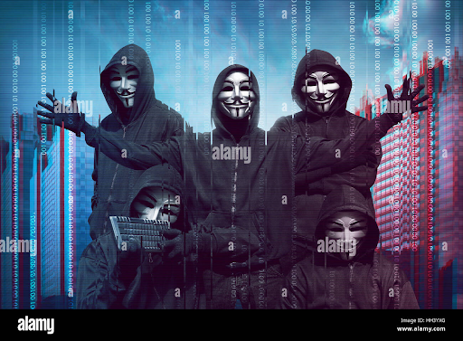

<h1><strong>Présentation de certains groupes de hackers connus</strong></h1>

 
 

 

 
Une menace persistante avancée (APT) est un acteur malveillant qui possède des compétences et des ressources extraordinaires, lui permettant d'infiltrer et d'exfiltrer le réseau d'une organisation. Les APT utilisent une variété de techniques, de tactiques et d'outils, tels que des attaques d'ingénierie sociale très ciblées, des ransomwares , des exploits de vulnérabilité et des zero-days pour atteindre leurs objectifs illicites.

### 1 - Les différents profils dans l’underground

Le côté obscur de la cybersécurité regorge de plusieurs profils blackhat. Nous avons : 

#### Les Hackers d’Etat (State/Nation Sponsored Hackers) 

Les pirates informatiques parrainés par un État ou une nation sont nommés par le gouvernement d'un pays pour accéder aux systèmes informatiques d'un autre pays. Leurs compétences en cybersécurité sont utilisées pour récupérer des informations confidentielles d'autres pays en vue d'une menace ou d'une attaque potentielle à venir, ainsi que pour garder le pouls des situations sensibles qui pourraient constituer une menace à l'avenir. Ces types de pirates sont embauchés uniquement par des agences gouvernementales.

#### Les Hacktivistes

Leur principale  motivation d’ordre politique. Ces spécialistes de la cybersécurité piratent les organisations, systèmes gouvernementaux dans le but de divulguer des informations sensibles à des fins de protestation politique. 
  

### 2 - Les raisons et enjeux  de leur passage au côté obscur 

Les motivations sont extrêmement variées,  les hackers sponsorisés par les Etats sont motivés par les activités d’espionnage économique, industriel et politique. Ces groupes recherchent continuellement les vulnérabilités sur les infrastructures critiques d’un autre pays.  Par contre, la cause des hackers hacktivistes est la politique. Ce qui n’est vraiment  pas le cas avec les groupes en bande organisée, ceux sont  motivés par les revenus financiers vu que la cybercriminalité rapporte environ trois plus que le trafic de drogue.  L’activité des groupes cybercriminels tourne autour de la vente de documents, de données de santé, de logiciels malveillants, service de botnet, outils de phishing et des ransomwares clé en main ( Ransomware as a service) qui selon l’agence Europol  reste une priorité.

### 3 -  Les groupes les plus prolifiques 

#### Fancy Bear (APT 28)

C’est un acteur de la menace probablement  d’origine russe. Certains spécialistes font partie des services de renseignement de la Russie , le GRU, le renseignement militaire. Ce groupe est actif depuis 2004. Cet acteur de la menace   a mené les cyberattaques les plus spectaculaires comme la cyberattaque de TV5 Monde ayant impacté 192 millions de foyers dans plus de 200 pays et territoires en 2015 ,  mais aussi en 2016 avec le piratage du parti démocrate américain qui a été le principal facteur dudit aux élections présidentielles de 2016.
  

#### Cozy Bear (APT 29)

Ce groupe est affilié au service de renseignement  intérieur russe, le FSB. Il été indexé comme étant impliqué dans la cyberattaque du parti démocrate américain (CNDC) aux côtés de Fancy Bear. En 2020, il est accusé par les autorités canadiennes, américaines et britanniques de dérober les informations concernant le développement d’un vaccin contre le Covid-19.
  

#### Equation Group

Equation group est un acteur de la menace lié à l’Agence Nationale de Sécurité Américaine (NSA). Ce groupe serait à l’origine de malware Stuxnet , ver ayant saboté le fonctionnement en 2010 des centrifugeuses iraniennes d’enrichissement d’uranium.  Selon Kaspersky Lab, ce groupe est à l’origine de plus de 500 infections de logiciels malveillants dans 42 pays.

En 2017,  l’un des groupes de piratage appelé Shadow Brokers a publié une série d’outils de cyberespionnage d'Équation Group. Dans ces leaks, réside l’une des vulnérabilités 0 Day affectant l’éditeur  microsoft et qui sera utilisé plus tard dans le ransomware WanaCry qui est considéré comme la plus vaste  campagne d’attaque par ransomware au monde.

  

#### Lazarus

Lazarus est un groupe de piratage affilié au gouvernement nord corréen ce groupe est l’origine de puissante cyberattaque contre Sony en 2014, aussi de wanna cry en 2017. Ce groupe se fait passer pour des recruteurs sur linkedin  dans le but de cibler les géants de l’aérospatial et de la défense. La montée en puissance de Lazarus depuis ses débuts en 2007 témoigne à la fois de l’évolution des priorités du régime nord-coréen et de la place toujours grandissante des pirates informatiques dans l’appareil d’État.
  

#### Conti

Contrairement aux autres groupes cités ci-dessus , Conti est un groupe de cybercriminels en bande organisée , très puissant . Ce groupe a lancé une vaste cyberattaque par  ransomware ayant ciblé 27  infrastructures gouvernementales  Costa Rica  a tel point que le pays a déclaré l’état d’urgence en mai dernier.  Plutôt en mars 2022, suite aux événements en Ukraine, les membres ukrainiens du groupe se sont retirés suite au soutien officiel du groupe  à la Russie, ceci a entraîné une fuite massive d’environ 60 000 messages internes et des leaks de code source du ransomware portant le même non.
  

#### LockBit

Lockbit 3.0. Derrière ce nom cryptique, une organisation cybercriminelle russophone, qui œuvre à travers le monde grâce à un rançongiciel très développé. Et qui n’est pas à son premier coup d’essai.  Les cybercriminels de Lockbit 3.0 diffèrent quelque peu des autres organisations du milieu. Par leur longévité, d’abord. Le groupe, formé en 2019, monte en puissance depuis. Selon le site spécialisé en cybersécurité Zataz , Lockbit 3.0 aurait plus de 1 200 piratages à son actif. Le groupe fonctionnerait à la manière d’une start-up, avec une centaine de  partenaires affiliés dans le monde. Leur ransonware est considéré comme le plus  performant.

#### Opera1er

Identifié en 2019 par l'équipe threat intel de Group-IB, le cybergang francophone OPERA1ER est parvenu à extorquer 11 millions de dollars à des organismes bancaires, financiers et de télécommunications en Afrique de l'Ouest. 35 cyberattaques connues ont été identifiées entre 2018 et 2022. Le groupe de hackers est formé de membres francophones opérant très probablement depuis l'Afrique. En plus de cibler des entreprises dans l'Ouest de ce continent, ce cybergang a également frappé des organisations en Argentine, au Paraguay et au Bangladesh. 
OPERA1ER s'appuie sur des outils open source, des logiciels malveillants et des frameworks tels que Metasploit et Cobalt Strike,

#### Anonymous

C'est un réseau vaguement associé de hacktivistes. Un site Web associé au groupe le décrit . Le groupe est connu pour une série de piratages très médiatisés et d'attaques par déni de service distribué (DDoS) sur des sites Web gouvernementaux, religieux et d'entreprise.
Anonymous est né en 2003 sur  4chan, représentant le concept de nombreux utilisateurs de la communauté en ligne et hors ligne existant simultanément en tant que cerveau mondial anarchique et numérisé. Le groupe est également associé au wiki ouvert satirique Encyclopedia Dramatica. Les membres anonymes (appelés « Anons ») se distinguent en public par le port de masques stylisés de Guy Fawkes.

Pour plus d’infos sur les groupes APT , leur Tactiques, Techniques et Procédures (TTP), veuillez consulter les sources ci-dessous.

 
 

## Source:
- [Présentation de certains APT](https://www.mandiant.com/resources/insights/apt-groups) 

- [APT Groups and Operations](https://docs.google.com/spreadsheets/d/1H9_xaxQHpWaa4O_Son4Gx0YOIzlcBWMsdvePFX68EKU/edit#gid=361554658) 

 
 

 <strong> A bientôt :) </strong>

 <strong> Keep Hacking </strong>. 

