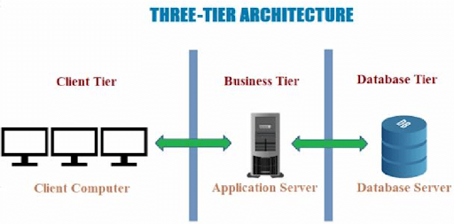
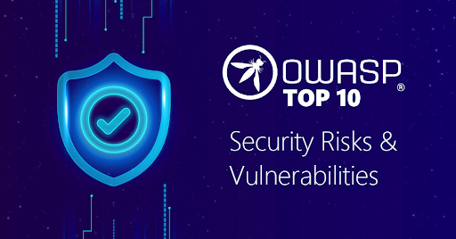

<h1><strong>Test d’intrusion web: les bases à maîtriser</strong></h1>

 
 

 

### 1 - Comprendre  le fonctionnement du web

Le web est connu comme un modèle client-serveur. L’ordinateur est le client et les ordinateurs distants stockant des données font  office de serveur.   Pour  accéder aux ressources (disponibles sur les sites web), il est impératif d’utiliser le protocole HTTP ( Hypertext Transfer Protocol) , pour des raisons de sécurité des échanges , la version sécurisée est conseillée , le HTTPS  avec le S pour secure. Cette version sécurisée utilise la couche supplémentaire SSL/TLS.

 
Pour être pentester web, vous devez donc bien maîtriser  le fonctionnement du protocole HTTP et tout le fonctionnement connexe (code d’état ou status code, méthodes, mesures de sécurité )

### 2 - Les  applications web ( langage de programmation, architecture, protocole tls)

Les applications web fonctionnent en mode clients serveur  sous plusieurs architectures (3 tiers, un tiers). Plusieurs langages de programmation participent à leur mise en œuvre . Le javascript ( pour le front end), php, java, python pour ce ne citer que ceux là pour le backend. Les langages SQL ou NoSQL sont aussi nécessaires pour faire des requêtes vers la base de données.

 

Une personne souhaitant devenir spécialiste de la recherche de vulnérabilités web doit avoir une solide compréhension de plusieurs  de ces technologies. S’il audite une application web développée en java comme back-end, il devra comprendre du J2E par exemple.

Il n’est toutefois pas demandé d’être forcément développeur web avant de lancer pentest web, une solide base suffit.

### 3 - L’Open Web Application Security Project (OWASP) ( description, présentation des risques du top 10 2021)

 

L’Open Web Application Security Project  est une organisation à but non lucratif  qui a pour  objectif  d’améliorer  la sécurité des applications web. Cette organisation met à la disposition de la communication des outils  gratuits (owasp zap, codeQL)   pour l’évaluation du niveau de sécurité des applications web.
 

  

L’organisme fournit tous les trois ou quatre ans un top 10 des risques et vulnérabilités concernant les applications web, les api et même les applications mobiles.

Il est donc très important de  maîtriser les risques énumérés  ainsi que les techniques d’exploitation de ces vulnérabilités.
Vous pouvez avoir plus d'informations  sur les risques du top 10 web  et les api respectivement dans les liens ci-dessous.

N’hésitez pas aussi  à lire  le Web Security Testing Guide qui est un guide complet pour tester la sécurité des applications Web et des services Web.

 

## Source:
- [OWASP Top 10 Web ](https://owasp.org/Top10/) 
- [OWASP Top 10 API ](https://owasp.org/www-project-api-security/) 
- [OWASP Web Security Testing Guide ](https://owasp.org/www-project-web-security-testing-guide/latest/)

 
 

 <strong> A bientôt :) </strong>

 <strong> Keep Hacking </strong>. 

