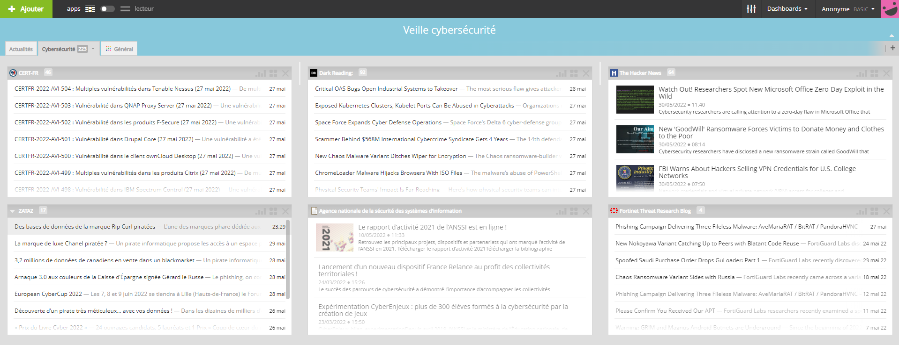

# Article 2
# Comment réaliser une veille technologique efficace ?

<h1><strong>Active Directory : Sa structure physique et pourquoi doit-on le sécuriser ?</strong></h1>

Qu’est ce que c’est la veille technologique ? Pourquoi la réaliser ? Dans cet article, nous souhaitons aborder avec vous l’importance de réaliser une veille technologique efficace pour l’ensemble des acteurs du secteur informatique et plus particulièrement de la cybersécurité. Nous vous donnerons de même des conseils pour vous aider à la mettre en œuvre. 

## La veille technologique, c’est quoi et pourquoi faut-il la réaliser? 

Étant dans un secteur évoluant rapidement, il est impératif de rester au contact des innovations technologiques qui ne cessent de croître aux vues des nombreuses cyberattaques ces dernières années. La veille technologique a donc pour but principal d’anticiper sinon d’identifier les nouvelles tendances naissantes dans son secteur d’activité. Si vous souhaitez avoir toujours une visibilité de votre domaine professionnel, être incontournable sur les thématiques clés qui vous intéressent, il est indispensable de mener une veille technologique adéquate.

De nos jours, mener une veille technologique à des enjeux à la fois professionnel dans la mesure où vous vous développez et améliorez vos compétences dans votre domaine et économique car plus vous maitrisez un domaine, plus vous deviendrez expert et serez donc amené à évoluer d’un point de vue salarial. Dans le cadre d’une entreprise, une équipe qui mène une veille technologique représente pour celle-ci un enjeu Stratégique vis-à-vis des concurrents car cela lui permettra de garder toujours une avance sur ceux-ci.

## Quels sont les objectifs derrière la veille technologique ?

Elle permet de constituer une base de compétence, d’informations importantes pour suivre, comprendre, identifier les nouvelles tendances technologiques du secteur;

Elle représente un moyen de collecter des informations utiles en vue de garantir une politique stratégique et concurrentielle sur l’évolution des produits, des  systèmes, et différentes  pratiques  ;

Elle représente une opportunité de création de réseautage et d’échange de connaissance pouvant découler sur des partenariats ou des collaborations inter-entreprises.

Alors maintenant que tout est clair, vous vous dites mais oui c’est très bien tout ça mais comment doit-on s'y prendre pour mettre en place une veille technologique efficace?  Et bien, nous allons l’aborder en quelques points.

## Quelles sont les grandes étapes pour mettre en place une veille technologique ?

Qui dit veille technologique, dit bien évidemment … recherche perpétuelle et je suis persuadé que vous avez dû le comprendre en ce moment. Cependant, cette recherche doit être ciblée, amenuisée dépendant de vos centres d’intérêts. Déclinons donc le procédé en 3 étapes:

- 
 Identifier ses centres d’intérêts et circonscrire ses besoins par rapport aux centres d’intérêts identifiés. Par exemple, imaginons vous êtes intéressé par la sécurité informatique fonctionnelle, mais quels sont vos besoins en particuliers ? Voulez vous monter en compétence sur des problématiques de gouvernance ? de risques ? de conformité aux référentiels? Ou les trois ? Vous devez avoir une idée claire de vos besoins sinon vous ne serez pas efficace;

- 
Identifier les sources d’informations crédibles et légitimes vis-à-vis des besoins identifiés dans l’étape précédente. Pour rebondir sur l’exemple de la première étape, il faut prioriser les sites connus et réputés dans le domaine de la sécurité fonctionnelle tel que les sites de normalisation internationale (ISO), l’ANSSI (Agence Nationale de la Sécurité des Systèmes d’Information), le site officiel du NIST, etc.

    

- 
Trouver un moyen de les agréger afin de facilement et rapidement pouvoir accéder à ces informations.

Pour les débutants, il peut être intéressant d’aller sur des thématiques générales avant de mettre en place un système d’entonnoir sur leur veille car cela leur permettra d’agrandir leur culture technologique de manière générale et leur facilitera par la suite la sélection des thématiques qui leur paraissent plus intéressantes.

C’est bien de procéder aux étapes précédentes mais le plus important reste d’analyser les informations récoltées. Il faut avant tout, en cas d’utilisation de sources pas très crédibles, vérifier les informations collectées avant de les diffuser, attention aux fake news.

C’est bien tout cela, mais vous avez dû le remarquer vous êtes sur un site dédié à la cybersécurité :-D, nous allons donc vous donner des ressources et nos astuces personnelles pour la réalisation de notre veille technologique.

## Quelques astuces intéressantes

Avant de les délivrer, nous souhaitons revenir sur l’importance de réaliser la veille de manière générale et plus particulièrement la veille technologique. En tant que grand féru de la sécurité informatique fonctionnelle et plus particulièrement de la norme ISO 27001 qui incite vivement par la méthodologie PDCA à adopter une approche d’amélioration continue. 
En ce qui nous concerne, nous utilisons les flux RSS pour réaliser notre veille technologique. De nombreux sites d’informations proposent des flux RSS qui peuvent être agrégés via des outils gratuits tels que celui que nous utilisons dénommé Netvibes. Il existe néanmoins divers outils, des agrégateurs de flux que vous pouvez rechercher par vous même.
Pour rappel, "Les flux RSS (“Really Simple Syndication” en français “Syndication réellement simple”) sont des fichiers dont l’objectif est de stocker une liste de contenus ou de pages web.” comme le définit le site 1min30. 
Revenons à Netvibes. Il permet de créer un dashboard fournissant les informations provenant de l’ensemble des flux RSS que vous choisirez conformément à vos centres d’intérêts et vos besoins. Si vous avez du mal à l’utiliser, n’hésitez pas à nous le signifier, on vous aidera :-).
Je vous partage une capture de mon dashboard personnel mais retenez qu’il est assez exhaustif et vous pourrez trouver partout sur Internet des ressources typiques cybersécurité telles que le CERT FR (Computer Emergency Response Team Français), l’ANSSI, la CNIL, Zataz, Dark reading pour en citer que quelques unes.

Il est de même possible de réaliser sa veille via les réseaux professionnels du style Linkedin mais aussi Twitter  où de nombreux acteurs réalisent de la veille technologique active. Il vous suffit de les suivre et de consulter de temps à autre votre file d’actualité afin de réaliser votre veille.
Par rapport à la cybersécurité, nous vous encourageons à vous abonner aux profils suivants qui sont des professionnels expérimentés et qui réalisent une veille vraiment proactive. 
Cette liste est non exhaustive mais vous verrez bien évidemment que des profils se démarquent plus que certains par rapport à vos centres d’intérêts personnels. Nous vous proposons donc:

- [M. Matthieu Garin](https://www.linkedin.com/in/matthieu-garin-3336481?miniProfileUrn=urn%3Ali%3Afs_miniProfile%3AACoAAABF09cBV8SxQpfKMC_4DtEfRLTp7_RH7H8&lipi=urn%3Ali%3Apage%3Ad_flagship3_search_srp_all%3ByYCbm%2BfuQFSaZqA%2Bg2Pj8g%3D%3D)
- [M. Martial Gervaise](https://www.linkedin.com/in/martial-gervaise-840737a4?miniProfileUrn=urn%3Ali%3Afs_miniProfile%3AACoAABYtevAB0Cg1QIPQABUfuRtg2UtqG8-22dE&lipi=urn%3Ali%3Apage%3Ad_flagship3_search_srp_all%3BMknthnoNRa%2B3O%2Fk%2BaO0y6Q%3D%3D)
- [M. Clément Domingo](https://www.linkedin.com/in/clementdomingo?miniProfileUrn=urn%3Ali%3Afs_miniProfile%3AACoAAA0NTOMBxL1sCPJQBFt6pgwlBEeL-ADVvr8&lipi=urn%3Ali%3Apage%3Ad_flagship3_search_srp_all%3B%2BK%2Fl3hfBTpOloC8kt9dEJg%3D%3D)
- [M. Joas A. Santos](https://www.linkedin.com/in/joas-antonio-dos-santos?miniProfileUrn=urn%3Ali%3Afs_miniProfile%3AACoAACQUGCUBpvQerFv0ut2s0MSLX9IwuKJJrbU&lipi=urn%3Ali%3Apage%3Ad_flagship3_search_srp_all%3BJcPAARBOTNK9NVXquj14lQ%3D%3D)
- [M. Gerome Billois](https://www.linkedin.com/in/gbillois?miniProfileUrn=urn%3Ali%3Afs_miniProfile%3AACoAAABcou4BCFV4rXmezf7l3raMTguOTst_wVA&lipi=urn%3Ali%3Apage%3Ad_flagship3_search_srp_all%3BQ7UONuyQSVuUlwD1WOluag%3D%3D)
- [M. Joel Ramat](https://www.linkedin.com/in/joelramat?miniProfileUrn=urn%3Ali%3Afs_miniProfile%3AACoAAAFmAvkBBk3oQLkRVllWpfKghF3z0XOohhM&lipi=urn%3Ali%3Apage%3Ad_flagship3_search_srp_people%3BYkELqH2JREqX36NURbdNsA%3D%3D)

Pour finir, il est de même recommandé d’appartenir à des groupes d’entraide, de consulter des blogs et de s’inscrire à des newsletters pour recevoir les alertes technologiques importantes. 
N’hésitez pas à nous contacter si vous souhaitez des articles sur ce genre de thématique ou sur une en particulier qui vous intéresse.

**A Bientôt !**

## Source:
[Veille technologique](https://www.kbcrawl.com/fr/intelligence-economique/veille-innovation/veille-technologique-reponse-aux-enjeux-dinnovation/#:~:text=La%20veille%20technologique%2C%20c'est,d%C3%A9velopper%20et%20exploiter%20des%20inventions.)

[Flux RSS](https://www.1min30.com/dictionnaire-du-web/flux-rss)

