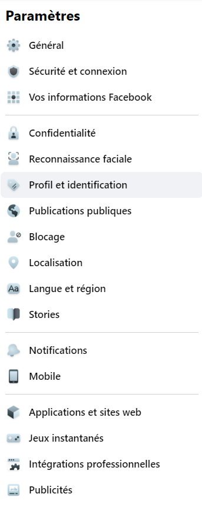
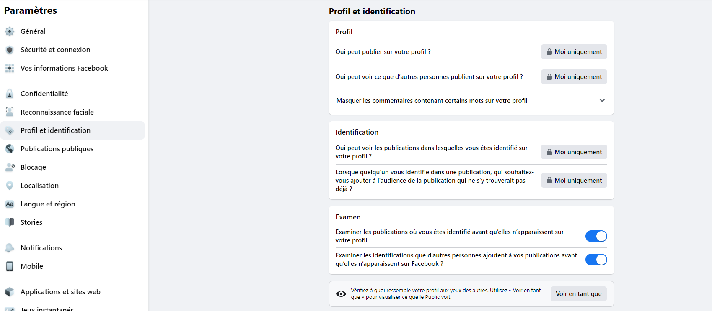
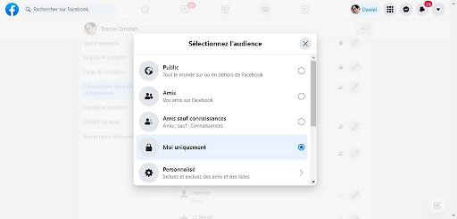
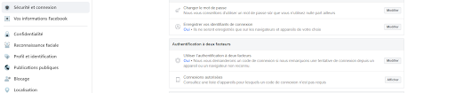

<h1><strong>PARTIE I
  
Comment mieux gérer son identité numérique sur les réseaux sociaux ? </strong></h1>

 

Ces mesures s’appliquent en très grande partie de façon identique sur  tous les réseaux sociaux. Nous parlerons ici de Facebook vu qu’il est le réseau social le plus utilisé.  

 

Le souci concernant Facebook est que les réglages par défaut ont tendance à exposer un grand nombre de vos informations à d'autres personnes, y compris à des inconnus qui se contenterait  de visiter votre page et votre profil. Bien évidemment, les chasseurs de tête et agences de recrutement se font un plaisir de passer à la loupe ce type d'information s'ils y ont accès. Parfois, s'ils remontent loin dans le temps, ils peuvent tomber sur des publications que vous avez postées 10 ans plus tôt et qui ne reflètent pas votre situation actuelle.

### 1 -Les informations,  photos ou vidéos publiées

Ces données publiées sur facebook pourraient donner dans certains cas trop de détails (avis politique, idéologie, mode de vie, type d’amis )  sur notre personnalité. Ces informations qui seront de nature publique pourraient dans certaines configurations nous porter préjudice  vis-à- vis des recruteurs potentiels,  de notre communauté, de nos amis ou de nos prochaines activités.
Facebook nous donne accès à plusieurs options pour mieux gérer notre compte :

 

Dans la section profil et identification, nous avons les options suivantes :

 

Nous devons limiter les informations que  nous publions et de même définir l’audience concernant la visibilité de nos publications. Cela nous permet de savoir qui peut voir ce que nous publions. 

 

En plus de ces actions, nous devons activer certains paramètres de sécurité pour protéger nos comptes en cas d’actions malveillantes. 

### 2 - Avoir un bon mot de passe pour son compte    

Le mot de passe de votre compte Facebook est évidemment la base de la base. C’est la clé de la porte d’entrée vers notre compte. il faut choisir un mot de passe fort, le plus long possible et y  ajouter des majuscules, des chiffres, des caractères spéciaux.
Des solutions comme Dashlane, 1Password, NordPass et autres enregistrent et chiffrent nos mots de passe. Nous n’avons donc pas à retenir tous les mots de passe complexes que l’on a pour chacun de nos comptes.

 

### 3 - Activer l’authentification à double facteur

On reçoit, par SMS, un code de 6 chiffres que l’on va devoir inscrire pour se connecter après avoir saisi  notre mot de passe. 

 

### 4 - Activer les alertes de connexion

Si l’idée de la double authentification vous semble laborieuse ou que vous voulez quand même ajouter une précaution supplémentaire, il est possible d’activer les alertes de connexion sur son compte Facebook.

Une fois activée, dès lors qu’une connexion est faite sur notre compte, Facebook va nous avertir. On peut déterminer si l’on veut être averti via une notification Facebook, Messenger ou bien par e-mail..

 

### 5 - Choisir des contacts de confiance pour récupérer son compte

Dans une situation où toutes ces barrières auraient été traversées par des pirates, il reste un dernier espoir avant de devoir passer par le support de Facebook. Cet espoir réside dans nos amis de confiance.

Facebook offre la possibilité de nommer des amis de confiance qui pourront nous aider à récupérer notre compte s’il devait être compromis.
Dans une telle situation, ces derniers peuvent nous envoyer une URL, un lien  qui nous permettra de réaccéder à notre compte.
Le chapitre suivant  parlera des mesures à prendre pour protéger son identité sur les applications de messagerie instantanées.

 

 
 

 <strong> A bientôt :) </strong>

 <strong> Keep Hacking </strong>. 

