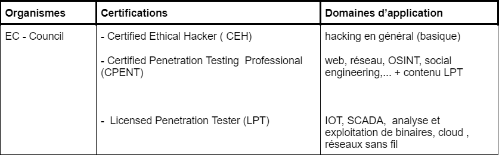
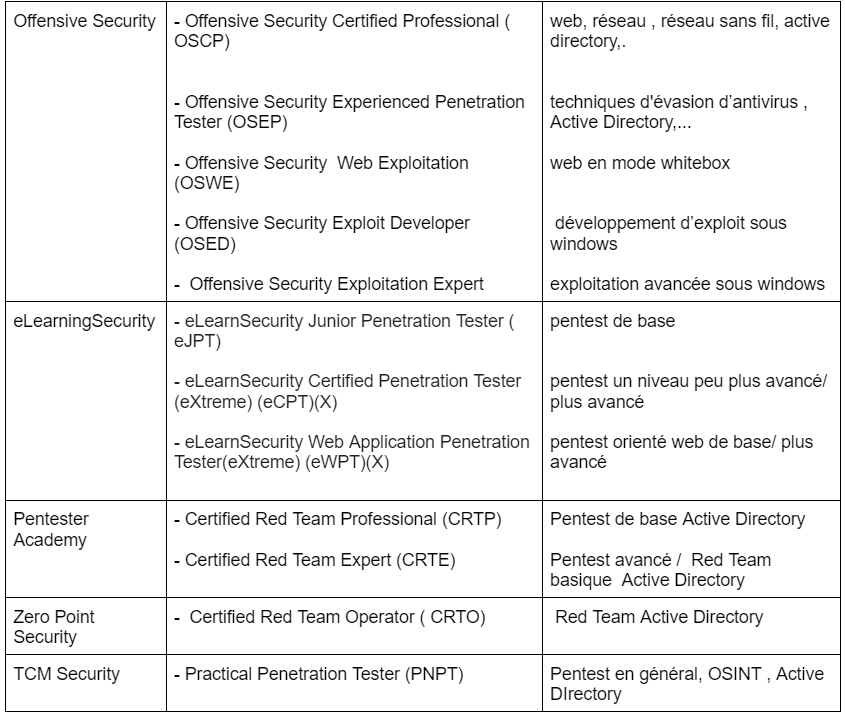
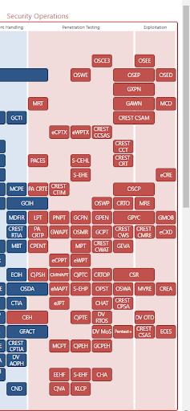

<h1><strong>Sécurité offensive : certifications et plateformes d'entraînement</strong></h1>

 
 

 

### 1 -Le monde de la  sécurité offensive

La sécurité offensive est une approche proactive pour protéger un système d’information contre les différentes cyberattaques.  

Ce domaine de la cybersécurité permet de simuler des cyberattaques à  travers des techniques d’évaluation de la sécurité, de tests d’intrusion ou de red teaming. En gros,  nous nous mettons dans la peau d’un acteur malveillant dans le but de tester le niveau de sécurité  mis en place à l’équipe sécurité traditionnelle , l’équipe de sécurité défensive  ( ingénieurs sécurité réseau, équipe soc, administration système et sécurité ). 

Les entreprises de toute taille et les particuliers et même les Etats  sont à la recherche de professionnels de la sécurité offensive (en proposant des salaires exorbitants ) qui sont appelés hackers éthiques, pentesters ou red teamer pour ceux effectuant les tests d’intrusion plus avancés.

### 2 - Les certifications en sécurité offensive

Dans le domaine de la sécurité offensive, les  certifications sont très utiles pour acquérir dans certains cas la connaissance  mais d’être compétitif sur le marché de l’emploi.

 

Nous avons les acteurs traditionnels du domaine  comme  <strong> Offensive Security, EC-Council</strong> mais aussi de nouveaux organismes qui commencent à se faire connaître et proposer du contenu précis et de qualité. Ce sont en autres <strong>eLearningSecurity , Pentester Academy, Zero point security,  TCM Security.</strong>

 

 

   Ces certifications ont des prix allant de <strong> 299  à plus de 5000  dollars.</strong>

 

Dans le tableau ci-dessous, nous avons certaines  certifications en sécurité offensive qu’offrent ces organismes.

 

 
 

 

Pour plus de détails sur ces certifications ou  si vous pouvez consulter les autres certifications, vous pouvez consulter la  roadmap de Paul Jerimy en regardant à l’extrême ( partie en rouge) pour les certifications en offsec. Vous pouvez cliquer directement sur chaque certification pour être redirigé sur la page officielle avec plus de détails . Plus elles sont hautes plus elles sont difficiles :)  .

Vous avez ci-dessous une image d’illustration.

 

 

### 3 - Plateformes pour s'entraîner

Il est très important de pratiquer, toujours pratiquer  pour  garder la main et maîtriser les techniques d’exploitation. De ce fait, plusieurs plateformes ont été créées en ligne dans le but d'offrir des environnements pour apprendre et pratiquer. 

Nous avons en autres : 

  
-  [Hack The Box ](http://hackthebox.com) 

 

 Excellente plateforme, sinon la plus célèbre car elle offre des machines (box) style boot to root permettant d'acquérir de solides compétences en test d’intrusion. Nous avons aussi des challenges,  des environnements appelés Pro Labs qui sont des environnements simulant des réseaux d'entreprise.  Depuis un certain moment elle délivre du contenu d’apprentissage, Hack The Box Academy (  https://academy.hackthebox.com/ ) . Nous avons maintenant sur cette plateforme  la délivrance d’une certification en bug bounty hunting (HTB Certified Bug Bounty Hunter , HTB CBBH, https://academy.hackthebox.com/preview/certifications/htb-certified-bug-bounty-hunter?utm_source=banner&utm_medium=website&utm_campaign=cbbh&utm_content=20220309- ).

 

-  [Try Hack Me ](https://tryhackme.com/) 

 

 TryHackMe est différent de toute autre expérience d'apprentissage ;la plate-forme enseigne non seulement les concepts de sécurité, mais permet aux utilisateurs de mettre leurs connaissances théoriques en pratique en compromettant les machines vulnérables du monde réel, ce qui peut être fait via le navigateur.

 

## Source:
- [Top 5 Penetration Testing Methodologies and Standards](https://www.vumetric.com/blog/top-penetration-testing-methodologies/) 

 
 

 <strong> A bientôt :) </strong>

 <strong> Keep Hacking </strong>. 

