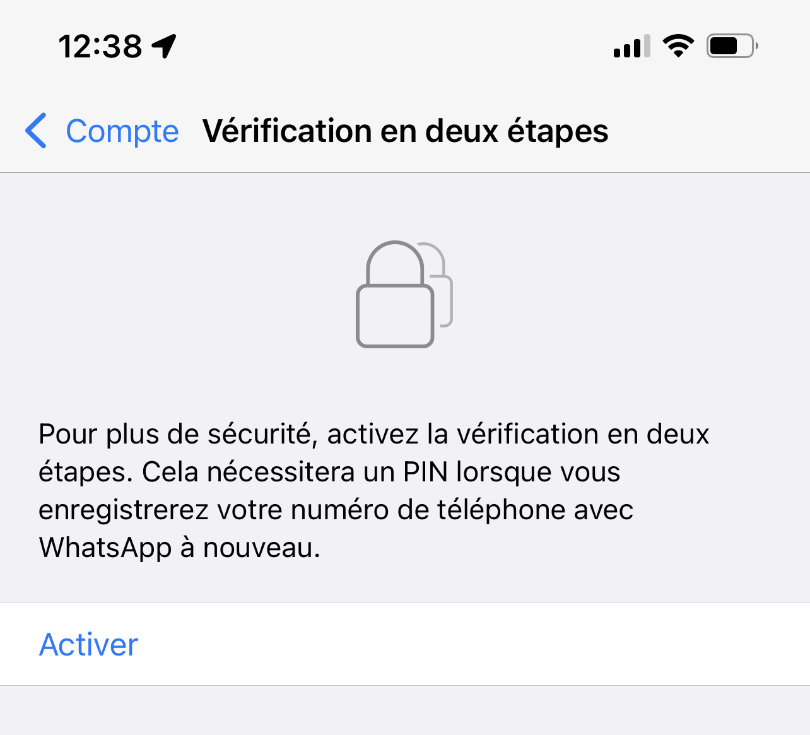
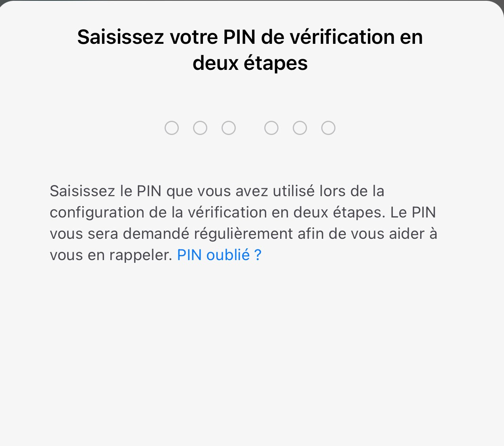
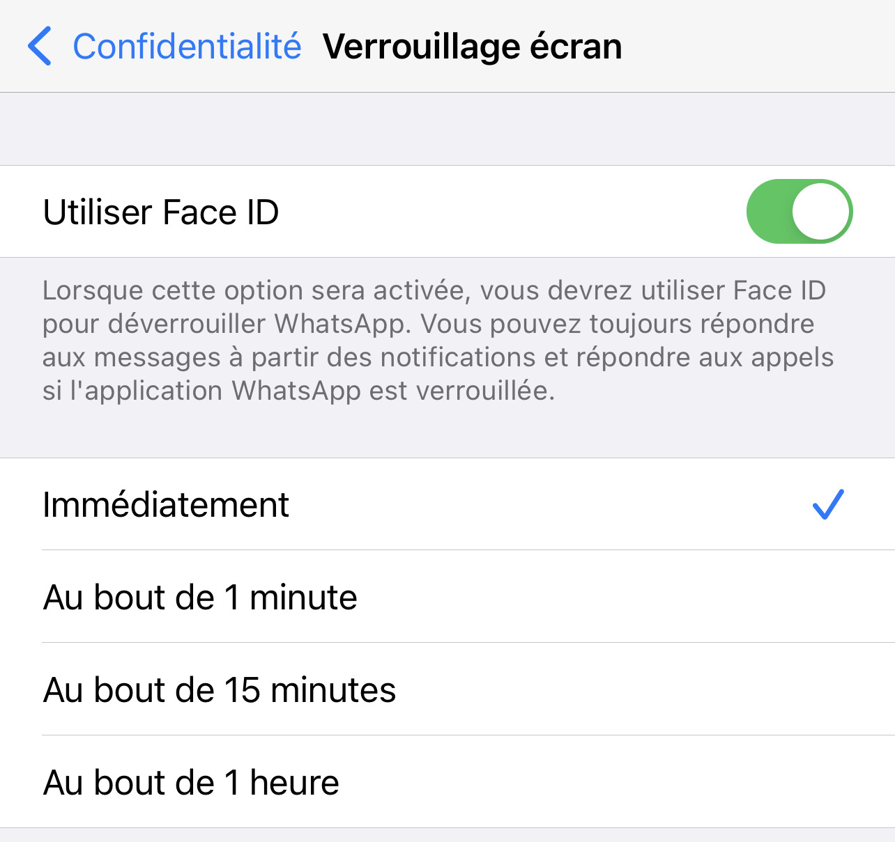
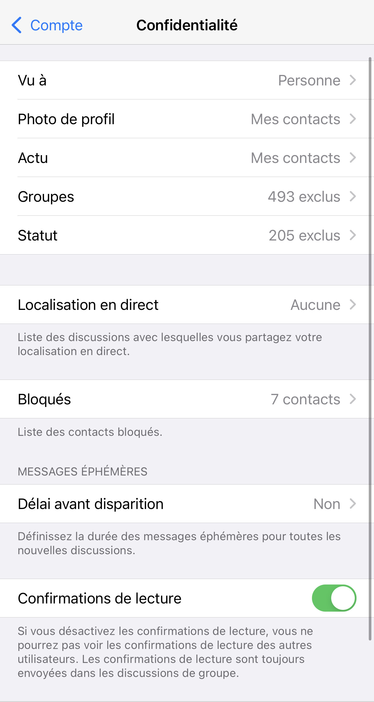
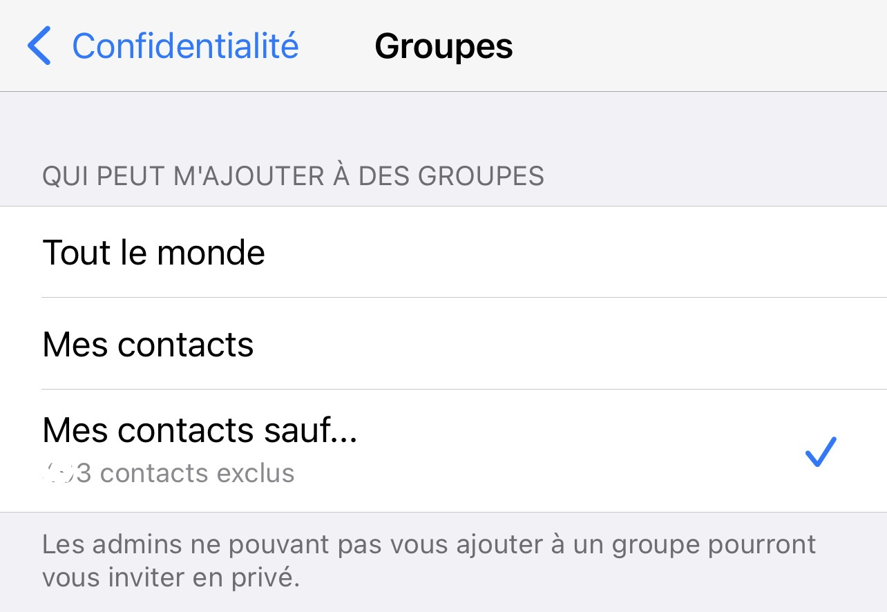
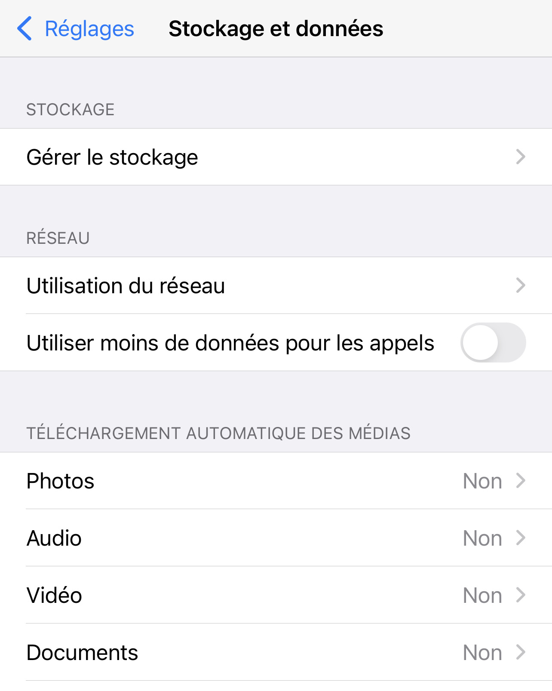
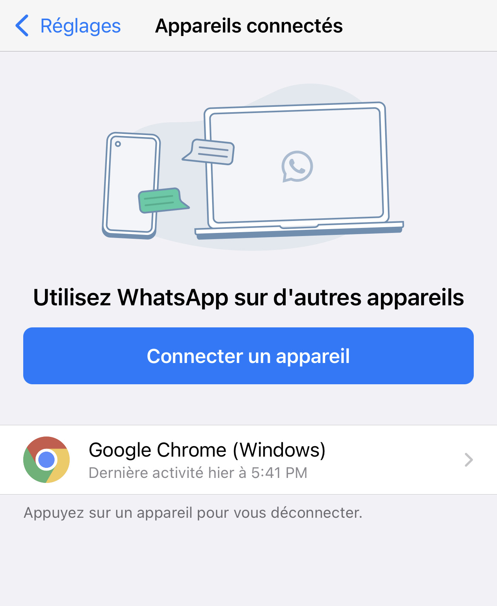
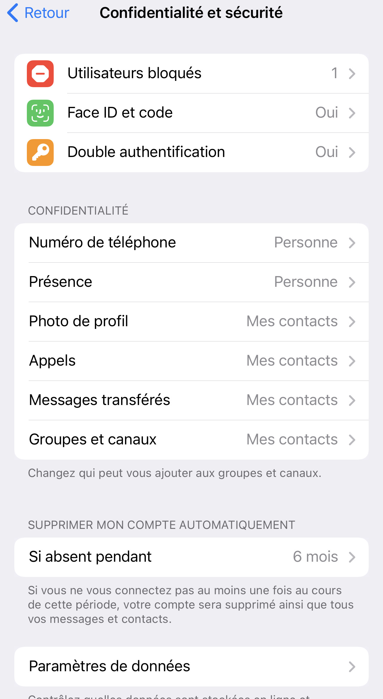
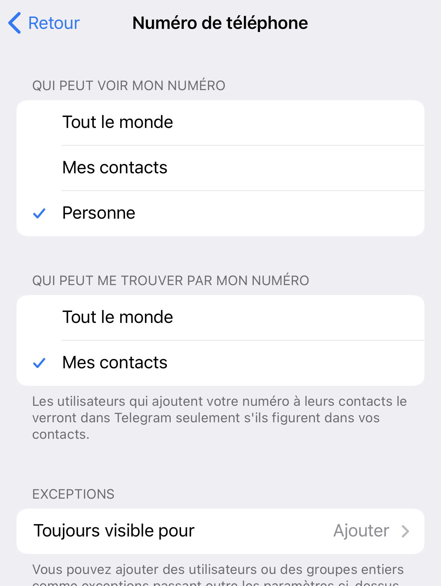
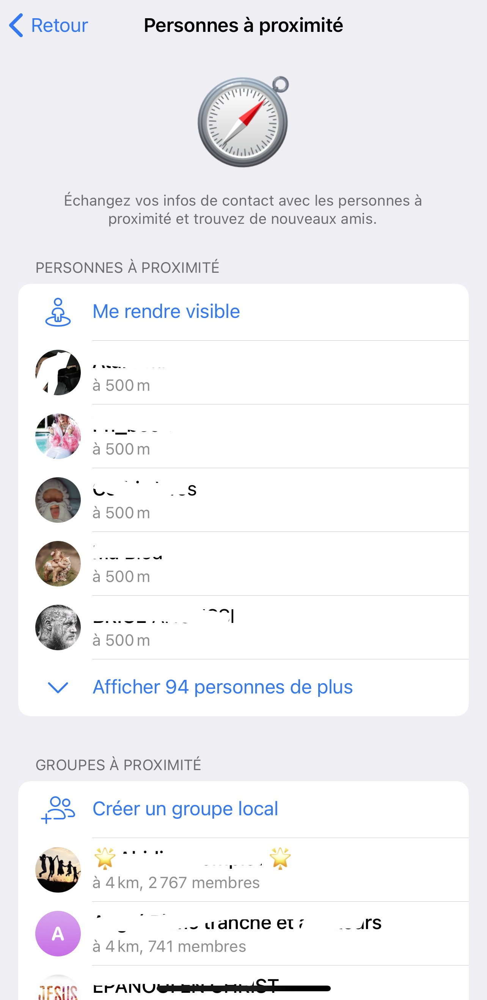

<h1><strong>PARTIE II</strong></h1>

<h1><strong>
  
Comment mieux gérer son identité numérique sur les applications de
 messagerie instantanée ?  </strong></h1>

 

Aujourd’hui, les applications de messagerie ne sont plus  uniquement utilisées  pour rester en contact avec sa famille ou ses amis. Elles servent également pour échanger avec ses collègues, ses supérieurs, voire également avec des marques et de procéder à des paiements. Il est donc important d’éviter que son compte soit piraté. Cela pourrait avoir des conséquences désastreuses ou s'avérer être très ennuyeux.   

 

Nous allons présenter quelques mesures de protection de sa vie privée sur l’application de messagerie la plus célèbre : <strong>WhatsApp</strong> ainsi que l’application de messagerie <strong>Telegram</strong>.

### 1 -WhatsApp 

 #### Activer la vérification en 2 étapes

La première chose à faire pour éviter que son compte WhatsApp soit piraté est de renforcer sa sécurité. Pour cela, le plus simple est d’activer la vérification en deux étapes. Cela permet en effet de renforcer la sécurité de votre compte puisque vous devrez renseigner le code PIN que vous avez choisi à intervalle régulier, afin de vérifier que vous êtes bien le propriétaire du compte.

 

 

 

Pour activer l’option, rendez-vous dans les paramètres de WhatsApp, option Compte et sélectionnez « Vérification en deux étapes ». Vous devrez ensuite taper un code à 6 chiffres et renseigner votre adresse mail. De cette manière, si vous oubliez votre code à 6 chiffres, WhatsApp pourra vous envoyer un mail pour le réinitialiser.

 #### Verrouillage par empreinte digitale ou la reconnaissance faciale

Pour renforcer la sécurité de votre compte, vous pouvez également activer le déverrouillage par empreinte digitale. De cette manière, personne ne pourra accéder à vos conversations WhatsApp puisqu’il faudra impérativement scanner votre empreinte digitale pour avoir accès à l’application de messagerie.

Son activation est très simple, il suffit de se rendre dans les Paramètres de l’app, option Compte, puis Confidentialité. Tout en bas, sélectionnez « Verrouillage par empreinte digitale » et choisissez le verrouillage automatique « immédiatement ». De cette manière, vous devrez scanner votre empreinte pour ouvrir l’app et accéder à vos conversations. À noter qu’il sera toujours possible de répondre aux appels téléphoniques WhatsApp, même si l’app est verrouillée.

Sur certains smartphones comme à partir des iphones X , il est également possible d’utiliser la reconnaissance faciale pour sécuriser son compte.

 

 

#### Éviter de répondre aux numéros inconnus

Il est impossible d’éviter d’être contacté  par un inconnu une fois que cette personne a notre numéro. Il est donc préférable d’éviter de répondre. Si cette personne commence à nous inquiéter,  nous pouvons la bloquer.  

En évitant de communiquer avec cette personne,  nous sommes moins exposés  à certains types de piratage informatique (ingénierie sociale, collecte d’informations à des fins d’usurpation d'identité).

 

 #### Ajuster les paramètres de confidentialité

Dans cette section, nous pouvons par exemple autoriser  uniquement nos contacts à savoir quand nous étions connectés pour la dernière fois  à l’application (Vu à ) , à avoir notre photo de profil . Si cette option est laissée  à “ tout le monde “ , des inconnus  ayant notre notre numéro sans qu’on ne soit au courant pourraient avoir une photo de nous.  Nous pouvons définir qui pourrait voir nos statuts: 

 

  

 

 

 

Nous pouvons définir en sélectionnant  les contacts  qui pourraient nous ajouter dans des groupes.  Il est préférable d’exclure tous nos  contacts et dans ce cas , un message de demande d’ajout  à un groupe nous sera envoyé. L’ajout ne se fera donc pas automatiquement.  

 

 

 

#### Ajuster les paramètres de stockage de données

Il est important de bloquer le téléchargement automatique des photos, audio et vidéo pour ne pas avoir à recevoir des fichiers indésirables dans  notre galerie.

 

  

 

 

#### Vérifier régulièrement les appareils connectés

Il est également possible de vérifier  les appareils connectés à votre compte dans le but de s’assurer que WhatsApp web n’est pas enregistré sur un navigateur qui nous est inconnu. Si c’est le cas, nous pourrons facilement déconnecter l’appareil.

 

  

 
 

 

### 2 -Telegram 

Certaines méthodes et bonnes pratiques  de sécurité s’appliquent également à  telegram ( authentification double , code d’accès à l’application,...). Nous  présenterons ici des mesures en majorité qui lui sont  propres. 

 

 #### Filtrer les informations partagées

Si Telegram nous demande très peu d'informations lors de la création de compte, nous pouvons les compléter par la suite en ajoutant des informations.

Ces informations, si elles ne sont a priori pas sensibles, peuvent ne pas avoir vocation à être divulguées à tout le monde. C'est pour cela que Telegram offre la possibilité de choisir à qui vous affichez certains détails de votre profil. À vos contacts uniquement, ou même à personne : le choix nous est laissé.
 

 

  #### Utiliser une photo de profil qui ne permet pas aux inconnus de nous retrouver

  

  Si vous êtes coutumier des conversations sur des groupes et des canaux publics, vous voudriez certainement apprendre comment il est possible de masquer sa photo de profil aux inconnus sur Telegram.  

En effet, votre photo de profil peut servir à vous identifier, et donc être utilisées par des personnes mal intentionnées pour vous nuire. Pour éviter cela, choisissez une photo de profil différente sur les réseaux sociaux/messageries où vous souhaitez rester anonyme. 

  

  #### Ajuster les paramètres de confidentialité et de sécurité 

   

#### Désactiver la fonctionnalité “Personnes à proximité”

  

  Nous pouvons permettre à ce que personne ne puisse voir notre numéro de téléphone ainsi que permettre à nos contacts  de nous retrouver.
 
Dans cette configuration recommandée,  seuls nos contacts pourront voir notre photo de profil, nous appeler, transférer nos messages et nous ajouter dans différents groupes ou canaux. En se limitant  uniquement qu’aux contacts,   nous limitons le risque d'exposition aux actions malveillantes de personnes inconnues.

 

  

  
 

 

 

 

  
 

 

 

#### Désactiver la fonctionnalité “Personnes à proximité”

  

  Personnes à proximité est une fonction que nous trouvons dans l’application de messagerie, qui, une fois activée, nous permettra de voir les autres personnes qui utilisent l’application à proximité, ainsi que les groupes ouverts qui se trouvent dans la zone. Nous pourrons envoyer des messages à ces personnes et elles pourront également nous écrire à tout moment, comme avec vos contacts, seulement dans ce cas, ce sont des étrangers.
 
L’activation des personnes à proximité dans l’application permettra à toute personne de votre région avec cette fonctionnalité activée de vous envoyer un message. Ce n’est pas la meilleure option si vous cherchez à utiliser l’application en privé, car cette fonctionnalité vous expose quelque peu, bien que ces personnes ne verront que votre nom d’utilisateur et jamais votre numéro de téléphone. Vous perdez votre vie privée en permettant à tout le monde de vous écrire.

 

  

  
 

 
 

 <strong> A bientôt :) </strong>

 <strong> Keep Hacking </strong>. 

