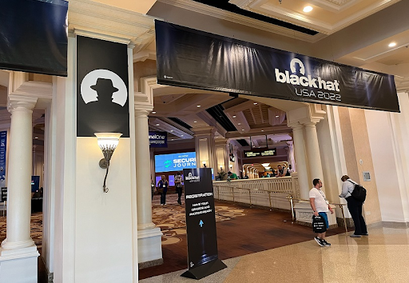

<h1><strong>Compétitions et conférences de cybersécurité</strong></h1>

 
 

 

La cybersécurité  regorge de plusieurs compétitions et conférences qui sont très souvent organisées  sur une année dans plusieurs régions du globe ( Amérique du Nord, EMEA, Asie,...). Elles étaient organisées sur site mais avec la pandémie de 2020 a bien favorisé l’approche online.
Nous allons  donc passer en revue les conférences dans le monde de  la cybersécurité , puis dans un second temps les différentes compétitions. 

### 1 - Conférences

#### DEFCON
 

 

DEF CON est la conférence sur la cybersécurité la plus populaire. Elle a été fondée par Jeff Moss. C’ est une conférence annuelle sur la cybersécurité organisée à Las Vegas, Nevada, États-Unis. La première DEF CON a eu lieu en juin 1993, ce qui en fait l'une des plus anciennes conférences sur la cybersécurité. Le public de cette convention est pour la plupart composé de professionnels de la sécurité des systèmes d'information, de crackers, hackers, journalistes, avocats et employés du gouvernement fédéral intéressés par la programmation, l'architecture, le phreaking, la modification de matériel informatique et tout ce qui peut être hacké. L’événement consiste en de multiples discours à propos de sujets liés aux ordinateurs ou au piratage. L'événement a eu sa 30e édition du 5 au 8 août dernier.  Des CTF sont organisés durant certaines sessions.

#### BLACKHAT

 

Black Hat est une société fondée en 1997 par Jeff Moss, réputée pour organiser un réseau de conférences fournissant des points de vue nouveaux et exclusifs sur la sécurité de l'information.
 

  

L’organisme fournit tous les trois ou quatre ans un top 10 des risques et vulnérabilités concernant les applications web, les api et même les applications mobiles.

Des formations sont  proposées  aux participants durant l’évènement. Ces formations visent des sujets allant des derniers tests d'intrusion à l'exploitation d'applications Web, en passant par la défense et la construction de systèmes SCADA. Souvent conçus exclusivement pour Black Hat, ces cours pratiques d'attaque et de défense sont dispensés par des experts de l'industrie et du domaine du monde entier, dans le but de définir et de défendre le paysage de la sécurité de l'information de demain.  
L’évènement a lieu  plusieurs fois dans l’année  aux Etats-Unis, en Europe , en Asie et au Moyen-Orient  Afrique. Vous pouvez consulter le site officiel  https://www.blackhat.com/  et la chaine youtube  pour  avoir plus d’informations ou regarder certaines conférences.

#### RSA

 

 

RSA Conference est une série de conférences portant sur la sécurité de l'information. Principalement destiné aux industriels, les conférences sont organisées à la fois aux États-Unis d'Amérique et en Europe, tous les ans depuis 1991 bien avant DefCon. Les thématiques  utilisées abordées  concernent entre autres   la sécurité de la vie privée,  les tests d’intrusion, les techniques de deepfake. 

#### FIC ( Forum International de la Cybersécurité)

 

 

La Gendarmerie Nationale  a lancé en 2007, avec le concours financier de la Région Hauts-de-France, la première édition du Forum International de la Cybercriminalité, un événement destiné aux professionnels de la cybersécurité issus des sphères publiques et privées afin qu'ils confrontent leurs points de vue et leurs expériences . Sous l'impulsion du Général d’armée Marc Watin-Augouard et du Colonel Régis Fohrer, le FIC est devenu le Forum international de la cybersécurité, qui se réunit une fois par an pour débattre des enjeux stratégiques de cybersécurité et de cyberdéfense. Cet événement  a lieu en France  majoritairement. Cependant , cette année 2022, nous avons eu  une édition   qui s’est tenue  en Amérique du nord (Montréal  au canda).

#### leHACK

 

 

Le Hack, anciennement Nuit du Hack est une des plus anciennes conférences de hacking francophone. Inspirée de la célèbre convention américaine DEFCON, elle a été initiée en 2003 par l’équipe HZV (hackerzvoice).  De nombreux sujets techniques sont  abordés notamment les attaques sur environnements Active Directory, OSINT, hardware hacking ou encore radio. Aussi, des challenges sous format de wargames sont organisés.

#### CAF (Cyber Africa Forum)

 

 

Le Cyber Africa Forum est  événement organisé  depuis Mai 2020 à Abidjan en Côte d’Ivoire  par Franck Kié où de nombreux experts de la cybersécurité présents ont, au cours des échanges, fait de fortes recommandations pour se prémunir des menaces de cyberattaques de plus récurrentes et importantes sur le continent africain.  Ce sont plusieurs dizaines d’experts panélistes et des centaines de professionnels de cet important secteur qui ont participé aux activités de réflexion et de propositions de solutions. Le thème principal de cette édition du CAF 2022, <strong>‘’Souveraineté numérique et protection des données comme leviers de croissance économique pour le continent africain’’</strong>, fortement apprécié,  a été décliné en 23 sous thèmes que les experts ont discutés à travers 23 panels.

#### Africa Cyber Defense Forum

 

 

C’est un événement annuel sur la cybersécurité ciblant différentes villes d'Afrique pour rassembler les plus grands experts mondiaux en sécurité, des héros de première ligne, des chefs de gouvernement et des cadres de diverses industries pour relever les défis du paysage des menaces d'aujourd'hui.  Cet évènement se fait en ligne  mais aussi en présentiel  au  Kenya. Lors de cet évènement un compétition de type CTF dénommée  Africa Cyberlympics.

### 2 -Compétitions

####  GLOBAL  CYBERLYMPICS

 

 

Les Cyberlympics sont une compétition destinée à un large éventail de professionnels de la sécurité informatique et bien qu’il inclut certains composants du CTF, les Cyberlympics vont au-delà du défi de base du CTF.  Il couvre  presque tous les domaines de la sécurité informatique tels que les tests d'intrusion, la criminalistique, les logiciels malveillants, l'analyse des logs , l'exploitation système, la sécurité physique . Les Cyberlympics ne se concentrent pas uniquement sur l'attaque ou la défense, mais plutôt sur une approche globale permettant aux équipes de rivaliser avec toutes les forces de cybersécurité qu'elles apportent à la compétition.

####  DGHacks
 

 

Le DG’hAck est un ensemble de challenges en ligne prenant la forme d’un « Capture The Flag » ou « CTF », ou comment mettre en évidence les vulnérabilités d’un système numérique.Un événement pour les passionnés. Débutants, étudiants, professionnels en cybersécurité, experts DGA et cybercombattants des armées, tous les participants sont les bienvenus. Pour cette édition, 23 challenges sont proposés. Tous les scénarios du DG’hAck ont été préparés et conçus en collaboration avec les cyberexperts du centre DGA Maitrise de l’information. Deux catégories sont récompensées : la catégorie étudiante et la catégorie professionnelle. Pour la catégorie étudiante, un entretien à la DGA pour un stage* sera proposé. Et pour la catégorie professionnelle : un entretien pour un poste* en cyber à la DGA.

####  AFRICA CYBERLYMPICS
 

 

Concours annuel continental est conçu pour combler le déficit de compétences en cybersécurité et la fracture numérique qui persistent en Afrique, tout en aidant le continent à développer son statut de pôle technologique émergent. Il s'agit d'un concours de cybersécurité et de cyberdéfense en ligne. Il oppose des équipes de tout le continent africain dans des scénarios pratiques intenses de 24 heures et des laboratoires virtuels pratiques qui couvrent une série de défis dans des domaines : Analyse forensique, reversing, la cryptographie, l’exploitation web.

Les équipes affrontent des joueurs de tous les 54 pays africains éligibles dans un tour éliminatoire en ligne de 24 heures. La compétition commence par un tour de pré-qualification où seules les meilleures équipes sont sélectionnées pour participer à la bataille finale de 24 heures. Les équipes sont composées de minimum 2 et maximum 4 joueurs.

####  HACKERLAB

 

 

Concours annuel continental est conçu pour combler le déficit de compétences en cybersécurité et la fracture numérique qui persistent en Afrique, tout en aidant le continent à développer son statut de pôle technologique émergent. Il s'agit d'un concours de cybersécurité et de cyberdéfense en ligne. Il oppose des équipes de tout le continent africain dans des scénarios pratiques intenses de 24 heures et des laboratoires virtuels pratiques qui couvrent une série de défis dans des domaines : Analyse forensique, reversing, la cryptographie, l’exploitation web.

Il a pour objectif  de détecter et de former à terme, des hackers éthiques, un maillon essentiel dans la lutte contre la cybercriminalité.

 La participation à certaines conférences est payante avec des prix allant de 50 à près de 5000 dollars. Par contre, la participation à plusieurs compétitions est gratuite. N’hésitez  donc pas à participer à ces différents évènements et compétitions votre culture et compétence.

 

 <strong> A bientôt :) </strong>

 <strong> Keep Hacking </strong>. 

