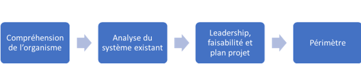

<h1><strong>Focus: les indispensables de la planification du SMSI</strong></h1>
<h2><strong>Partie 1</strong></h2>

 
 

 

Comme indiqué dans les précédents articles, nous allons aborder chacune des différentes phases du PDCA. Nous nous plongerons dans la peau d’un consultant GRC qui doit implémenter le SMSI d’une entreprise. Alors, quelles sont les différentes étapes de la planification.

A son arrivée dans un entreprise, dans le cadre de la mise en place d’un SMSI, le consultant GRC devra débuter par l’étude du contexte de l’entreprise qui l’accueille. Pour se faire, il existe plusieurs méthodes qui passent par des interviews, la lecture de corpus documentaire et bien d’autres. L’ISO 27001 est avant tout un projet et de ce fait, chaque entreprise a un contexte de certification différent qu’il faut evaluer en amont pour s’assurer que les objectifs recherchés soient atteints.

Mais quels sont les éléments qui seront recherchés par le consultant au travers de ces échanges ? Il évaluera les différents points évoqués ci-dessous:

- <strong>Mission, objectifs, valeurs, stratégies de l’organisme</strong>

Le consultant devra s’assurer de comprendre le métier de l’entreprise, le secteur d’activité, les valeurs qu’elle prône, les objectifs globaux (business et sécurité) ainsi que les stratégies d’affaires adoptées. Pour ce faire, il pourra recourir à la documentation portant sur les activités de l’entreprise, la description des pôles, services et produits, les fiches commerciales. En cas d’absence de documents, il pourra préparer des trames de questions pour atteindre ses objectifs. Ces éléments permettront au consultant d’obtenir une vue globale de l’organisme afin de pouvoir identifier les défis en matière de sécurité de l’information et les risques auxquels ils sont susceptibles d’être exposés.

- <strong>Environnement interne et externe</strong>

Il est important pour le consultant d’avoir une analyse du contexte stratégique de l’entreprise à travers une description de l’environnement interne et externe de celle-ci. Cela passe par plusieurs méthodes notamment l’analyse <strong>SWOT</strong> pour Strenghts, Weakness, Opportunities, Threats (Forces, Faiblesses, Opportunités, Ménaces en Français) ou l’analyse <strong>PEST</strong> pour Political, Economic, Social, Technological (Politique, Economique, Social et technological en français) ou encore l’analyse des cinq forces de Porter. Chacune de ces analyses sont des études qui sont très souvent menées en interne par les entreprises et ne doivent pas faire l’objet d’une étude à part entière de la part du Consultant. Il devra donc recueillir ces études auprès de ses interlocuteurs directs dans l’entreprise cible. 

Nous pouvons faire des articles sur chacune de ces méthodes si vous le souhaitiez même si ces méthodes rentrent plus dans le cadre de la gestion de projet et de la transformation digitale. Nous disposons tout de même de compétences dans ce domaine 🙂

Au delà de l’analyse de l’environnement stratégique, il faudra de même identifier d’un point de vue pilotage et opérationnel, les différents acteurs concernés. Au niveau de l’environnement interne, il faudra identifier la structure organisationnelle, les différents rôles et responsabilités, les relations entre eux, la répartition des tâches et les interactions avec les parténaires, sous traitants et différentes parties prenantes. Il est de même important d’identifier les responsables de la communication au sein de l’entreprise car la communication est un point clé dans la mise en oeuvre du SMSI.

- <strong>Principaux processus et activités</strong>

Le consultant doit maitriser les activités de l’organisme et leurs liens avec la sécurité de l’information. L’analyse des processus de gestion et des métiers de l’entreprise permet au consultant d’identifier les éléments pouvant exposer l’organisation à des risques de sécurité. 

- <strong>Parties intéressées</strong>

Les parties intéressées concerne à la fois les parties intéressées internes et externes de l’entreprise qui pourraient intervenir dans le processus de gestion de la sécurité de l’information. Il est important d’identifier l’ensembles des parties intéressées, les fournisseurs critiques car s’ils faillent à leurs responsabilités, cela peut avoir une incidence direct sur la sécurité de l’organisme.

Dans cette partie, on peut utiliser la matrice de Johnson & Scholes qui permettra de déterminer et gérer les parties intéressées et de par ricochet prioriser les efforts nécessaires pour allouer les ressources nécessaires pour répondre à leurs exigences.

- <strong>Exigences métier</strong>

Chaque business a des exigences liées à son business qu’elles soient commerciales, légales ou réglementaires. Pour s’assurer de les prendre en compte dans la gestion des risques, il faut les identifier et les analyser. En tant que consultant sécurité, nous devrons nous faire accompagné car nous disposons rarement de toutes les compétences de notre côté afin d’identifier par exemple les exigences de type juridique, contractuelles ou commerciales. Dans la formation ISO 27001 LI, il existe une matrice permettant d’identifier les lois et règlements, normes, marché et politiques internes applicables, le tout suivant leurs niveau de contraintes (obligatoires ou volontaires) ainsi que leur périmètre d’application(Interne ou externe à l’organisation).

Au niveau des exigences métier, il faut s’assurer de considérer à minima le RGPD dans les politiques à inclure (ou à mettre en oeuvre), la propriété intellectuelle et d’autres thématiques affiliées aux bonnes pratiques de l’ISO 27002.

- <strong>Objectifs du SMSI</strong>

Il faut établir sinon formaliser l’intention de l’organisation de traiter les risques et se conformer aux exigences de la norme à travers la définition à proprement dite des objectifs relatifs à la mise en place de l’ISO 27001. Ces objectifs devront être validés par le management et pourront evoluer en cours de projet, surtout à l’issu de l’analyse des écarts ou des risques où le périmètre pourra être amené à évoluer. 

- <strong>Définition préliminiare du périmètre</strong>

A partir de l’ensemble des informations abordées, le consultant en concert avec les parties prenantes du projet, auront l’ensemble des informations pour définir un périmètre initial de certification. Du périmètre initial identifié au départ avec les instances managériales, nous arriverons à la réduction du périmètre après les échanges avec les différentes équipes opérationnelles au travers des étapes à venir. Il sera raffiné, revu, réévalué en fin de planification.

Ce point met fin à la phase de l’étude du contexte de l’entreprise. Il possède toutes les informations afin de pouvoir aiguiller la mise en place du SMSI. Il procèdera maintenant à une analyse du système existant à travers la réalisation d’une analyse des écarts.

### En quoi est ce que consiste cette analyse ?

Cette analyse se divise en trois parties:
- Nous devons évaluer la situation actuelle de l’entreprise;
- Identifier l’état cible qui répond aux objectifs SMSI;
- La différence entre la situation actuelle et l’état cible.

Dans cette phase, le consultant pourra s’appuyer sur la norme ISO 27002 qui regroupe l’ensemble des bonnes pratiques pour le management de la sécurité de l’information ou de manière plus pratique s’appuyer sur l’annexe A de la norme ISO 27001 qui évoque l’ensemble des intitulés de cette norme. Basé sur cette annexe, le consultant, au travers d’entretiens avec les différentes parties prenantes, pourra évaluer sur une échelle allant de 0 à 5, les différents niveaux d’application de ces pratiques au niveau de son organisation.  

Pour être plus efficace, il est plus intéressant de procéder par atelier avec la présence de l’ensemble des parties prenantes que de réaliser des entretiens individuels.

Pour revenir sur l’échelle, nous proposons ci-dessous les différents niveaux adaptés:

- <strong>0: Absence totale de processus</strong>

L’entreprise n’est pas du tout consciente de l’absence totale de processus et de l’importance d’étudier la question;

- <strong>1: Processus en oeuvre occasionnellement sans méthode</strong>
  
L’organisation est consciente de l’importance de la mise en oeuvre du processus cependant il n’y a pas de processus normalisé;

- <strong>2: Processus non normalisés en place</strong>
  
Les processus sont développés de sorte que différents opérationnels utilisent tous les mêmes modes opératoires sans qu’il n’y ait de formation spécifique ou de procédure formalisée;

- <strong>3: Processus documentés et communiqués</strong>
  
Les procédures sont documentées, communiquées auprès des équipes mais leur utilisation est laissée à l’initiative des opérationnels;

- <strong>4: Processus surveillés et mesurés</strong>
  
Il existe des métriques qui permettent de surveiller et de mesurer la conformité des procédures vis à vis des standards de sécurité et qu’une réaction est définie en cas de défaillance du processus;

- <strong>5: Processus optimisés.</strong>
  

Le processus est conforme aux bonnes pratiques et standards et s’inscrit dans une logique d’amélioration continue afin de correspondre aux enjeux cybers grandissants.

Basés sur ces niveaux, l’on pourra attribuer des états pour la situation actuelle, les objectifs recherchés ainsi que le gap qui nous sépare de la réalisation de nos objectifs. Dans le cadre de l’analyse d’une entreprise possédant différentes filliales ou agences, il est intéressant de réaliser cette évaluation pour chacune des agences/filliales afin de pouvoir identifier le système de management le plus mature et de même le périmètre de départ adéquat. L’on pourra de même profiter de ces ateliers pour identifier les responsable par processus.

A l’issu de cette analyse des écarts, il est important de réaliser un rapport qui permet de revenir sur les éléments identifiés, les points sensibles et les décisions découlant de celle-ci. De façon pratique, ce rapport peut contenir entre autre un graphique Radar qui présentera l’état actuel et l’état cible par mesure ou par sous parties de l’annexe A. Cela permettra directement constater le gap des actions à réaliser pour atteindre les objectifs. 

Pour rappel, au moment de l’écriture de cet article, la norme ISO 27002 version 2022 a été publiée et de ce fait nous sommes passés à recatégorisation de la norme, éléments que nous évoquerons dans un prochain article 🙂.

A ce niveau, nous pourrons prendre quelques décisions quant à la réorganisation de la structure organisationelle (si nécessaire), la mise en place de l’équipe projet, la faisabilité du projet ainsi que la réalisation du plan projet.

Abordons tout d’abord la réalisation de l’étude faisabilité. Conformément aux indications de la formation PECB ISO 27001 LI, nous nous baserons sur la méthodologie PMBOK pour Project Management Body Of Knowledge où ll faudra considérer, identifier et renseigner les informations concernant l’environnement de l’entreprise, les buts & objectifs, le sommaire du projet, les bénéfices, le périmètre préliminaire, les ressources disponibles & nécessaires, les échéances & jalons, les rôles et responsabilités, le budget et pour finir les contraintes.

Ce document de faisabilité, si validé par le management, pourra être réutiliser afin de mettre en oeuvre le plan projet SMSI. Au delà des éléments identifiés dans le document de faisabilité, il faudra rajouter l’engagement écrit de la direction et le diagramme de gantt du projet. 

En ce qui concerne l’équipe projet, elle depend de la méthodologie de gestion de projet suivie. Toutefois, il faut un chef de projet SMSI, généralement le consultant GRC, le responsable côté client, c’est à dire l’interlocuteur direct faisant le lien entre la direction et le chef de projet SMSI. Il s’assurera de convaincre, de par son influence, le top management de mettre à disposition l’ensemble des ressources nécessaires pour l’atteinte des objectifs du projet. A ces deux princiaux rôles, l’on ajoutera des collaborateurs qui aideront à la prise de décisions et qui seront chargés de les assister pour la gestion des opérations du projet.

Une fois le plan projet validé et l’équipe projet en place, nous pourrons définir clairement le périmètre de certification du SMSI. Ce périmètre devra être documenté de façon claire car cela permet principalement de mobiliser les parties prenantes et de justifier la plus-value de débuter par ce périmètre en particulier aux parties intéressées. 

Ce document devra prendre en compte les limites organisationnelles que peuvent être les processus inclus dans le périmètre ou si nous limitons notre projet de certification uniquement à une agence, une filiale ou un département de l’entreprise. 

Il faut de même présenter les limites en termes de système d’information dans l’établissement du périmètre. Ce sont les éléments des systèmes qui seront pris en considération dans le périmètre en ne se limitant pas aux équipements matériels tels que les équipements réseaux, telecom mais de même aux données, aux applications, aux systèmes d’exploitation et tout élément relatif au SI.

Enfin, il faudra définir les limites physiques en identifiant clairement dans le document les lieux physiques et l’ensemble des sites où le SMSI sera établit.

En cas d’exclusions de certains points de l’annexe A, il est important de pouvoir les mentionner et  les justifier dans le document de périmètre. 

Basé sur notre expérience, nous vous conseillons de débuter par un périmètre restreint et de l’étendre par la suite à l’échelle de l’ensemble de l’organisation. Toute modification de périmètre devra faire l’objet d’une analyse des risques pour s’assurer de mettre en oeuvre l’ensemble des actions nécessaires pour aligner le SMSI au périmètre afin de pouvoir conserver la certification.

A ce stade, nous avons réalisé déjà l’étude du contexte, l’analyse de la situation de l’entreprise, le plan projet et établit le périmètre.

 

Nous évoquerons dans le prochain article les étapes restantes de la planification

### Sources

[Méthode PMBOK](https://www.skills4all.com/pmbok-quest-ce-que-la-methodologie-pmbok/#:~:text=Le%20PMBOK%20est%20un%20guide,ou%20encore%20de%20la%20communication)

Formation PECB ISO 27001 LI.
