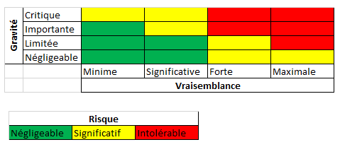
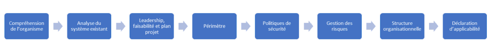

<h1><strong>Focus: les indispensables de la planification du SMSI</strong></h1>
<h2><strong>Partie 2</strong></h2>

 
 

 

Après la définition du périmètre de certification, point d’arrêt dans notre précédent article, nous nous attarderons dans celui-ci sur les dernières étapes de la phase de planification du cycle PDCA. Quelles sont ces étapes restantes?

L’analyse des écarts permet au consultant d’identifier le type de politiques, les politiques de sécurité spécifiques, les grandes parties de la politique de la sécurité de l’information ainsi que la politique de revue de celles-ci.

Un organisme qui doit mettre en place un SMSI doit au moins publier une politique de sécurité incluant les quatre points requis (article 5.2, a-d), exprimant l’orientation et les dispositions générales relatives à la sécurité de l’information. Cette politique doit être de même communiquée aux parties concernée conformément à la norme. 

De façon pratique dans les entreprises, vous retrouverez cette politique sous le nom de PSI pour Politique de Sécurité de l’information ou PGSI pour Politique Générale de la Sécurité de l’information. Au delà de comprendre les éléments évoqués ci-dessus, ele contient essentiellement les lignes directrices pour la gestion de la sécurité au sein de l’organisme, les objectifs généraux de sécurité afin de s’assurer de la continuité du business.

Au delà de cette politique générale, il est important de mettre en oeuvre des politiques spécifiques telle que la politique de sécurité des systèmes d’information qui abordent des sujets différents relatifs spécifiquement à la sécurisation du SI. Celle-ci abordera notamment différents domaines de la sécurité de l’information ou permettra de faire le lien avec des politiques détaillées de sécurité portant entre autre sur les thématiques suivantes (mais non limitées à celles-ci):

- Le contrôle d’accès
- La gestion des vulnérabilités
- La gestion des incidents
- la cryptographie
- La sécurité physique et environnementale
- La continuité et la reprise d’activité
- Les changements du SI
- La gestion documentaire
- etc.

Ces politiques spécifiques portent sur les exigences internes identifiées au niveau de l’analyse des écarts et doivent permettre de répondre aux objectifs et contraintes de l’environnement cyber et de ces évolutions.

Dans le processus de mise en place des politiques de sécurité, l’on dénote donc les différentes étapes suivantes:

- Création d’un modèle de politiques à travers l’établissement d’une structure type pour l’ensemble des politiques afin de conserver une certaine uniformité entre celles-ci et s’alignera à la politique de gestion documentaire;
- Rédaction de la politique de sécurité de l’information;
- Rédaction de la politique de sécurité du système d’information;
- Rédaction des politiques de sécurité spécifiques;
- Approbation par l’entreprise (management) des différentes politques;
- Communication et diffusion des politiques;
- Sensibilisation aux politiques des parties intéressées;
- Revue des politiques. 

Nous pourrons fournir si besoin, en guise d’exemple, quelques templates de certaines politiques détaillées. N’hésitez pas à nous solliciter pour cela 🙂

A ce stade, nous avons en termes de livrables:

- Le contexte de l’entreprise documenté;
- L’analyse des écarts;
- Le plan projet;
- Le périmètre;
- Les politiques de sécurité;

C’est parfait ! Nous allons aborder un élément clé de la phase de planification qu’est la <strong>GESTION DES RISQUES</strong>.

Le SMSI repose sur cette analyse des risques et son niveau d’implication dans la sécurité de l’information. Il existe deux grandes méthodes en termes de gestion des risques complètes. Nous avons la méthode décrite dans la norme ISO 27005 et la méthode EBIOS pour Evaluation des Besoins et Identification des Objectifs de Sécurité.

Au niveau des entreprises, il existe de même des politiques interne en termes de gestion des risques qui reposent souvent sur ces référenties. Dans cet article, nous détaillerons pas chacune de ces méthodes mais ils feront l’objet d’articles spécifiques prochainement. Nous aborderons vite fait, cependant, les grandes étapes de l’analyse des risques.

L’analyse des risques que nous proposons ici se divise en trois grandes étapes que sont:

- Inventaire des actifs du périmètre

Dans cette partie, le consultant avec les parties concernées procèderont à l’identification des actifs liés au périmètre de certification. Il faudra identifier pour chacun d’entre eux un responsable et les supports ou les lieux où on pourrait les retrouver.

### Pour rappel, qu’est ce qu’un actif dans une entreprise ?

Un actif de manière globale, est tout support contenant de l’information au sein d’une entreprise. On identifie les actifs primaires et les actifs secondaires.

Les actifs primaires sont les processus métiers ainsi que les informations d’une organisation. Il s’agit d’éléments jugés importants pour l’organisme. Dans la terminologie de la méthodologie d’Analyse de Risques EBIOS 2010, ils sont appelés biens essentiels.  

Les actifs secondaires sont les éléments du système d’information qui portent les actifs primaires. C’est grâce aux actifs secondaires que sont réalisés les processus métiers de l’organisme. Dans la terminologie de la méthodologie d’Analyse de Risques EBIOS 2010, ils sont appelés biens supports.  

On peut les catégoriser dépendant des entreprises en actifs informationnels, physiques, applicatifs et humains.

- Appréciation des risques

Elle débute par l’identification des sources de menaces liés à chacun des actifs et par l’évaluation pour chacun des critères de sécurité (Confidentialité, Intégrité, Disponibilité, Traçabilité) du niveau d’impact pour chacun des critères selon une échelle définie en amont (allant par exemple de 1-Négligeable à 4-Critique). Le niveau d’impact global de chaque actif pourra se faire sur la base de l’appréciation du niveau alloué à chacun des critères. A l’issu de l’évaluation de l’impact, il faudra de même estimer la vraisemblance des menaces identifiées par actifs suivant une échelle adaptée (par exemple 1-Improbable à 4-Certain) .

Le risque étant le croisement de la gravité (impact) et de la vraisemblance, nous pourrons nous baser sur des matrices bien connues de gestion des risques pour apprécier de façon définitive nos risques.

 

- Plan de traitement des risques

Nous déciderons dans cette partie du traitement applicable à chaque risque. Il y a quatre possibilités que sont: la réduction du risque, l’acceptation/maintien du risque, le partage du risque et la suppression/refus du risque. Nous détaillerons ces différentes possibilités dans l’article propre à la gestion des risques. 

A l’issu de cette phase, il faudra identifier les actions à mener vis à vis de l’option de traitement et leurs attribuer à chacune un responsable. Il faudra de même les lier à l’annexe A si la mise en place de certaines bonnes pratiques permet de répondre au risque identifié. On passera donc à l’évaluation du risque résiduel (intrinsèque à certaines décisions) et à la mise en place d’une cartographie des risques avant et après traitement pour clore la gestion des risques.

Ces différentes étapes seront consignées dans la politique de gestion des risques et nous tenons à rappeler le caractère important, primordial de cette phase qui peut être source de non conformité majeure vis à vis du processus d’acquisition de la norme. De plus, pour creuser un tout petit peu plus, vous pouvez recourir à la norme ISO 31000 Dédiée à la gestion des risques.

A ce stade, nous avons bien avancé mais nous devons nous assurer que la structure organisationnelle colle aux objectifs de l’entreprise. Par rapport au contexte et aux différentes parties prenantes, une réorganisation peut s’imposer afin de donner plus de pouvoir aux responsables sécurité (RSSI si existant ou Directeur Cyber). Il faut de même désigner un responsable SMSI qui sera en charge de la gestion du cycle de vie du SMSI. Au delà de ce rôle, les comités de pilotage SMSI, opérationnels, pilotage Sécurité, gestion de crises et COMEX devront être établis, formalisés et communiqués aux parties concernées.

Enfin, pour clore la phase de planification, il faudra établir la Déclaration d’Applicabilité (DdA). Au niveau de l’établissement du SMSI et de la mise en place des systèmes de management des normes ISO, la DdA est l’élement différenciant l’ISO 27001 de ses compaires. Elle est définie comme une “déclaration documentée décrivant les objectifs et les mesures de sécurité pertinentes et applciables au SMSI d’un organisme”. Autrement dit, ce document représente la prise en charge ou non dans le périmètre de certification des bonnes pratiques de l’annexe A avec les justifications des inclusions et exclusions des choix de ces mesures de sécurité. Dans certains cas, nous lions les risques à ce document lorsque ceux-ci sont resolus à travers l’application de certaines bonnes pratiques.

Il est important que la DDA soit validée par la direction car c’est le document par excellence de l’auditeur et celui-ci l’utilsera comme repère ou référence pour la réalisation de son audit. Il se doit donc d’être à jour et de correspondre aux enjeux recherchés par la mise en oeuvre du SMSI.

 

Nous voilà à la fin de la phase de planification. Nous aborderons dans le prochain article, le déploiement conformément à la roue de Dehming. D’ici là, n’hésitez pas à nous faire des remarques et suggestions pour l’amélioration de nos articles et de nos connaissances. La sécurité, c’est bien mais c’est encore mieux lorsqu’il y a partage de connaissance.

<strong>A très bientôt.</strong>

 
 

### Sources

- Norme ISO 27000

- [Evaluation du risque](https://www.developpez.net/forums/blogs/863457-autran/b9196/risque-pandemie-devra-etre-mieux-evalue-france/)

- Formation PECB ISO 27001 LI
